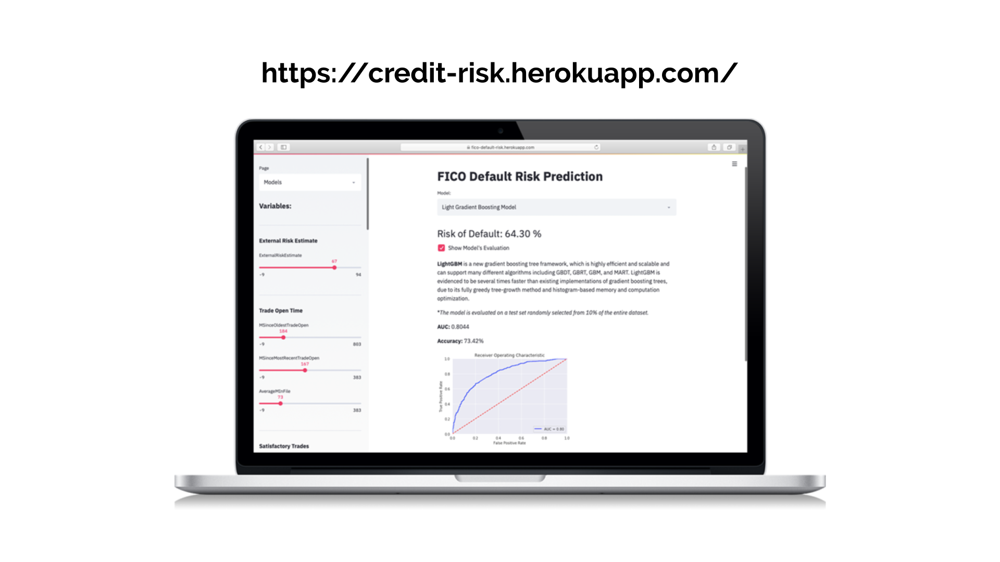

# Portfolio
---
## Machine Learning 

### Kaggle Competition: Predict Forest Cover Type using Naive Bayes, KNN Classifier, XGBoost, Random Forest and Extra Trees 

 The task was to predict the forest cover type (the predominant kind of cover) from strictly catographic variables. Comprehensive exploratory data anlysis to understand the importance and significance of the variables variables, identifying  outliers, correlations and peforming feature engineering to increase the accuracy of the prediction..

*  ***Skills***: Python | Matplotlib | Seaborn | Plotly | Scikit- learn Pipelines | Grid search | Hyperparameter Configuration | Data Visualization
 

---
### Kaggle Competition: Predicting whether passenger was sent to another dimension using manu models and parameters

 

Focus on data cleaning, feature relationship, missing values, data cleaning, feature engineering and modeling pipelines with very useful visuals.

* The data can be downloaded in [Kaggle](https://www.kaggle.com/competitions/spaceship-titanic)
* ***Skills***: Data Cleaning | Pipeline | GridSearch | Missing Values | Data Exploration | Crossvalidation
 

 

<table><tr>
<td></td>
<td>  </td>
</tr></table>
 

---

### Detect Spam Messages: TF-IDF and Naive Bayes Classifier

In order to predict whether a message is spam, first I vectorized text messages into a format that machine learning algorithms can understand using Bag-of-Word and TF-IDF. Then I trained a machine learning model to learn to discriminate between normal and spam messages. Finally, with the trained model, I classified unlabel messages into normal or spam.

 

 

---
## Data Science

### Credit Risk Prediction Web App

After my team preprocessed a dataset of 10K credit applications and built machine learning models to predict credit default risk, I built an interactive user interface with Streamlit and hosted the web app on Heroku server.

 

 

---
### Kaggle Competition: Predict Ames House Price using Lasso, Ridge, XGBoost and LightGBM

I performed comprehensive EDA to understand important variables, handled missing values, outliers, performed feature engineering, and ensembled machine learning models to predict house prices. My best model had Mean Absolute Error (MAE) of 12293.919, ranking <b>95/15502</b>, approximately <b>top 0.6%</b> in the Kaggle leaderboard.

 

 

---
### Predict Breast Cancer with RF, PCA and SVM using Python

In this project I am going to perform comprehensive EDA on the breast cancer dataset, then transform the data using Principal Components Analysis (PCA) and use Support Vector Machine (SVM) model to predict whether a patient has breast cancer.

 

 

---

© 2020 Khanh Tran. Powered by Jekyll and the Minimal Theme.

[def]: projects/forest-cover-type-classification.html

