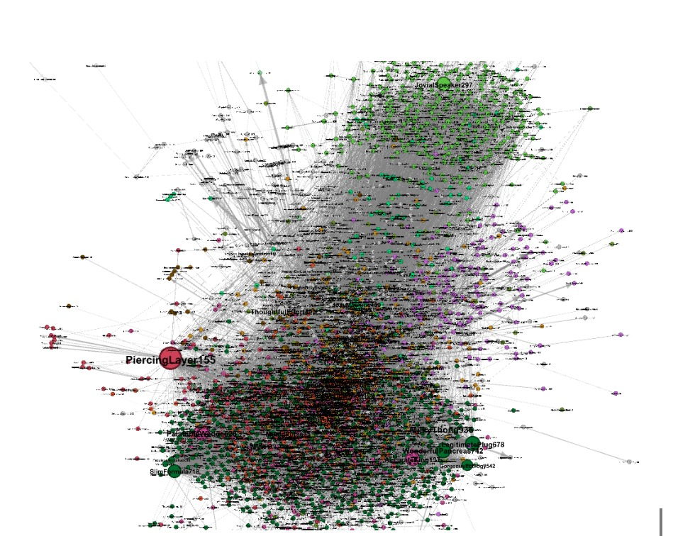
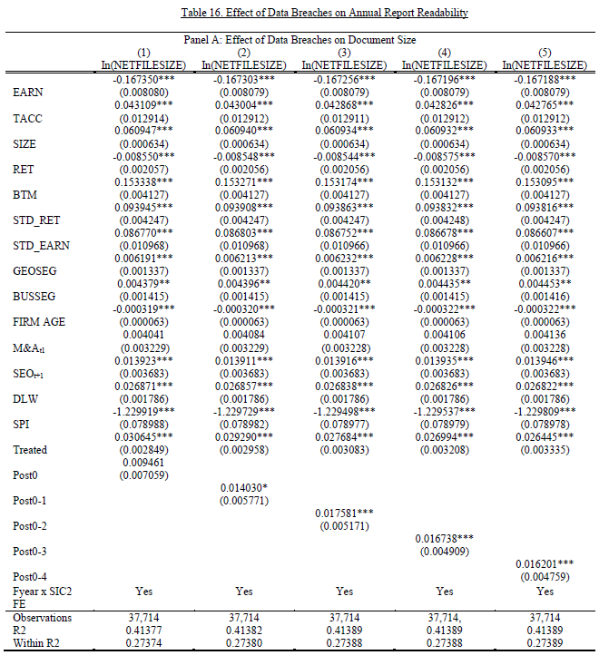

# Portfolio
## Machine Learning 
###  🚵‍♀️ Kaggle Competition: Forest Cover Type Prediction🚵‍♀️ 
[](projects/forest-cover-type-classification.html)
[](forest_cover_type_classification.ipynb)
[](https://colab.research.google.com/drive/15ZeArEeEWVRx-fLyK-ZtKPeqxLpz3H_B)

<div style="text-align: justify"> 

* Conducted a project on Machine Learning II and achieved the highest accuracy score compared to the other teams.
* Analyzed, cleaned, pre-processed and engineered features for the creation of machine learning models.
* Achieved a grade of 10/10</div>


***Skills***: Python | Matplotlib | Seaborn | Plotly | Scikit- learn Pipelines | Grid search | Hyperparameter Configuration | Data Visualization
<br>
<center></center>

---
### 🚀Kaggle Competition: Determining the Fate of Passengers in an Alternate Dimension 🚀

[](projects/spaceship-titanic.html)
[](https://github.com/maria-aguilera/spaceship-titanic)
[](https://colab.research.google.com/drive/1GgTDc8bqNdoxLfQ9bRVZQ1OFKEhcYz4x#scrollTo=kpC_nDA0OkkQ&uniqifier=1)
<br>
<div style="text-align: justify">

* Explored data cleaning, feature relationships, handling missing values, feature engineering, and developed modeling pipelines with informative visualizations.
* The data can be downloaded from [Kaggle](https://www.kaggle.com/competitions/spaceship-titanic)

***Skills***: Data Cleaning | Pipeline Development | GridSearch | Hadnling Missing Values | Data Exploration | Cross- validation
</div>
<br>
<center> </center>
<center></center>
<table><tr>
<td></td>
<td>  </td>
</tr></table>

---
### 🚲 Predict number bicycle users on an hourly basis🚲

[](projects/bike-sharing.html)
[](https://github.com/maria-aguilera/bike-sharing/blob/main/2_Group_A_Bike_Sharing.ipynb)
[](https://colab.research.google.com/drive/1ryydAJtLAJnjCMqVtIGNvLQh4qfEnSXc#scrollTo=TflFLV0YPFi1)

<div style="text-align: justify">

* Conducted a Python II Group Final Project to predict the total number of Washington D.c bycle users on an hourly basis.
* Conducted Exploratory Data Analysis, Data Cleaning & Analysis, and Time-Based Cross Validation.
Goal was to predict the total number of Washington D.C bicycle users on an hourly basis.

***Skills***: Data Visualization | Python
</div>
<br>
<center></center>
<center></center>
<br>


---
## Social Network Analysis
### ☎ nstagram Graph Analysis and Community Detection Algorithms ☎

[](projects/forest-cover-type-classification.html)
[](https://github.com/maria-aguilera/graph-analysis/blob/main/sna-instagram-network-analysis.ipynb)
[](https://colab.research.google.com/drive/1ryydAJtLAJnjCMqVtIGNvLQh4qfEnSXc#scrollTo=TflFLV0YPFi1)

<div style="text-align: justify"> 

* Using graph algorithims and GraphX to analyze and explore different patterns and communities in the instagram dataset. 
* Found out the most influential members of the network to increase sales by advertisement. 
* As the dataset was too large to process, we  had to do exploratory data analysis to check how to reduce it so that it didn't become a random network.

***Skills***: GraphX | Comunity Detection Algorithims
</div>

<br>
<center></center>
<br>

---
## Reinforcement Learning
### 🌔 Lundar Landing Assignment 🌔

[](https://huggingface.co/maria-aguilera/ppo-LunarLander-v2)
[](https://colab.research.google.com/drive/19m9fhUUrC8mJQzE6Ilieipgss8JIw4Xq#scrollTo=V7JUZKw5kq0m)
[](https://github.com/maria-aguilera/lunar-landing-ppo)
<div style="text-align: justify"> 

* Our goal is to teach the Lunar Lander (our agent) how to correctly land their spaceship between two flags (our landing pad).
*  The more accurately the agent is able to land, the bigger the ultimate reward he will be able to attain. 
* The agent may choose any of the following four actions at any moment to achieve this objective: fire the left engine, fire the right engine, fire down the engine, or do nothing.
***Skills***: Reinforcement Learning | Game Theory | Hyperparameter Tuning
</div>

<p align = "center">
<iframe width="560" height="315" src="https://www.youtube.com/embed/RSggurOx6Ug" title="YouTube video player" frameborder="0" allow="accelerometer; autoplay; clipboard-write; encrypted-media; gyroscope; picture-in-picture" allowfullscreen></iframe>
</p>

<br>

---
### 🚗Training AWS Car 🚗
* The goal was to create a custom reward function so that the AWS Deep Racer completes an unseen track as fastest as possible, and as accurately as possible. An example of a reward function would be:

***Skills***: Reinforcement Learning | Game Theory | Hyperparameter Tuning
```python

def reward_function(params):

  import math

def reward_function(params):

  # Read input parameters
  track_width = params['track_width']
  distance_from_center = params['distance_from_center']
  
  # reward function as Gauss curve with the variable distance_from_center
  reward = (1 / (math.sqrt(2 * math.pi * (track_width*2/15) ** 2)) * math.exp(-((distance_from_center + track_width/10) ** 2 / (4 * track_width*2/15) ** 2))) *(track_width*2/3)
  
  return float(reward)
    # - - - - -
    
    return speed_reward + heading_reward + steering_reward

```
 
<p align = "center">
<iframe width="560" height="315" src="https://www.youtube.com/embed/At4k1VLL1bM" title="YouTube video player" frameborder="0" allow="accelerometer; autoplay; clipboard-write; encrypted-media; gyroscope; picture-in-picture" allowfullscreen></iframe>
</p>
<br>

## Major Projects
### Corporate Data Breaches and Narrative Disclosures
  <a href="pdf/version_final_corporate_data_breaches_and_narrative_disclosures.pdf">Link</a>
* Undergraduate Thesis Project & 2019, 2020 INNCYYBER Innovation Award.
* 	The goal was to examine how data breaches influence corporate communication of public U.S. data breached firms by examining whether managers employ in opportunistic managerial discretionary disclosure behaviour in the narratives of the 10-K annual reports or whether they provide incremental useful information aimed at enhancing decision making by bridging information asymmetries between managers and company outsiders.
* Grade:  9.7/10.

**Skills**: R (Tidy verse, ggplot, lubridate, PostgreSQL), Fuzzy Matching (Fuzzy-Lookup Add-in), Econometrics & Statistics (DID, Logit, Fixed Effects).
<br>
<center></center>
<br>


---
### Master Thesis Project: Raw Material Forecasting of Industrias Duero

* Collaborated with five classmates to optimize the supply chain cycle to improve the company’s inventory turnover by predicting the demand and volume of raw material.
* Implemented predictive modelling strategies using machine learning, data science and time series forecasting techniques (e.g., ARIMA, ARMA, SARIMA, GARCH) and big data analysis (>1.5 M data points).

**Skills**: Python, Facebook Prophet, Time Series Analysis & Forecasting, XGboost, Catboost, Microsoft Power BI.
<br>
<center></center>
<br>


---
<center>© 2020 Khanh Tran. Powered by Jekyll and the Minimal Theme.</center>


