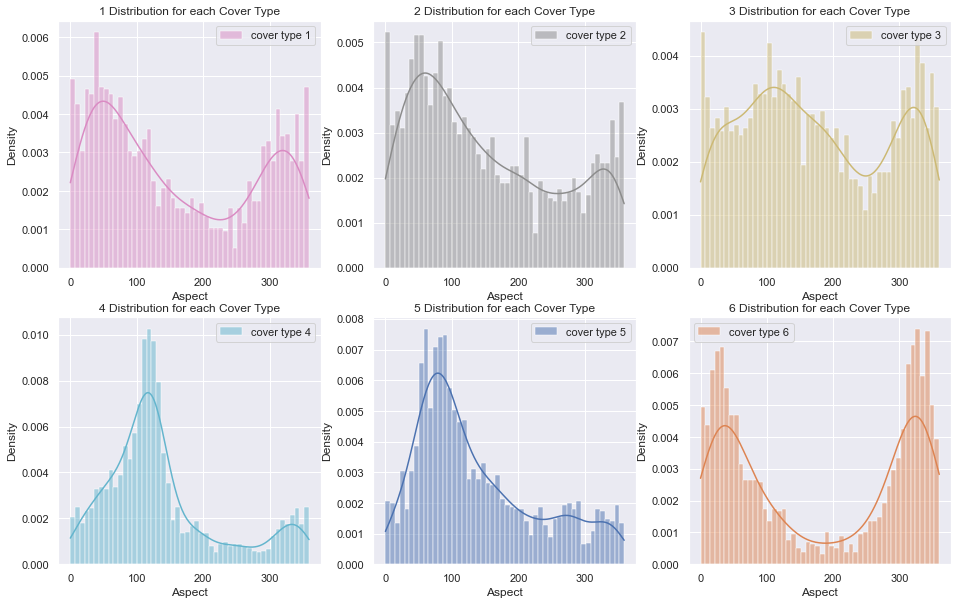
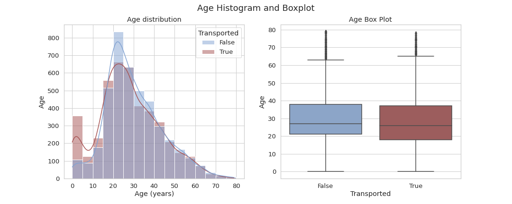
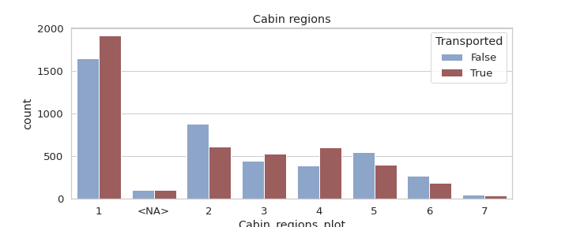
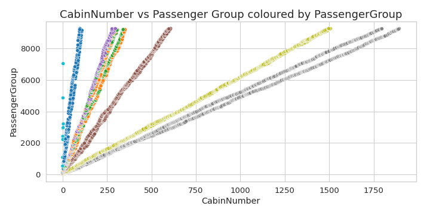

# Portfolio
---
## Machine Learning 

### Kaggle Competition: Predict Forest Cover Type using Naive Bayes, KNN Classifier, XGBoost, Random Forest and Extra Trees 

 The task was to predict the forest cover type (the predominant kind of cover) from strictly catographic variables. Comprehensive exploratory data anlysis to understand the importance and significance of the variables variables, identifying  outliers, correlations and peforming feature engineering to increase the accuracy of the prediction..

*  ***Skills***: Python | Matplotlib | Seaborn | Plotly | Scikit- learn Pipelines | Grid search | Hyperparameter Configuration | Data Visualization
 

---
### Kaggle Competition: Predicting whether passenger was sent to another dimension using manu models and parameters

 

Focus on data cleaning, feature relationship, missing values, data cleaning, feature engineering and modeling pipelines with very useful visuals..

* The data can we downloaded in [Kaggle](https://www.kaggle.com/competitions/spaceship-titanic)

 
 

 
 

 
<table><tr>
<td></td>
<td>  </td>
</tr><table>

 
 
 

---
